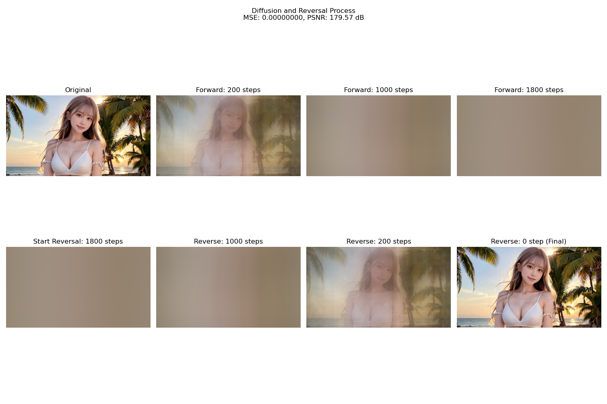

# LBDM
Lattice Boltzmann Diffusion Model

## Results

The following image demonstrates the LBDM diffusion and reversal process results (FP64):



*Diffusion and Reversal Process - MSE: 0.00000001, PSNR: 179.57 dB*

## Setup

### 1. Install Anaconda

If you don't have Anaconda installed, download and install it from the official website: [https://www.anaconda.com/products/distribution](https://www.anaconda.com/products/distribution)

Follow the installer instructions for your operating system.

This project can be run in your base Anaconda environment. Ensure your base environment has Python 3.9 or a compatible version. Core libraries like NumPy, Numba, and Matplotlib are typically included with Anaconda.

### 2. Install numba-cuda

If you installed CUDA 13.0 or higher version, please install numba-cuda by:

```bash
conda install -c conda-forge numba-cuda "cuda-version=13"
```

### 2. Install PyTorch and Torchvision

With your Anaconda environment activated (which is usually the base environment by default when you open Anaconda Prompt), install PyTorch and Torchvision. It's recommended to install them using the official PyTorch website's instructions to ensure compatibility with your CUDA version.

Go to [https://pytorch.org/get-started/locally/](https://pytorch.org/get-started/locally/) and select your preferences (e.g., OS, Package, Compute Platform). For
CUDA 13.0:

```bash
pip3 install torch torchvision --index-url https://download.pytorch.org/whl/cu130
```
